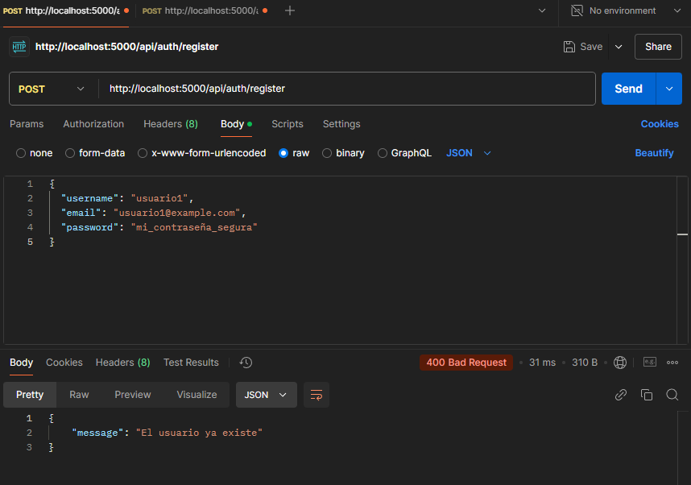
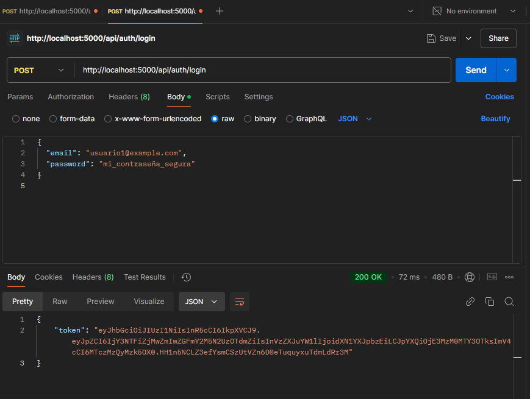

# Proyecto MERN - Setup Inicial

Este proyecto consiste en la configuración inicial de una aplicación utilizando el stack MERN (MongoDB, Express, React, Node.js). El objetivo fue crear una estructura básica y realizar las conexiones necesarias para que todas las partes del stack funcionen conjuntamente.

## Tecnologías Utilizadas
- **MongoDB**: Base de datos corriendo en un contenedor Docker.
- **Express**: Framework para el backend de Node.js.
- **React**: Frontend de la aplicación.
- **Node.js**: Entorno para el backend.
- **Docker**: Para contenerizar MongoDB.

## Pasos Realizados
1. **Estructura del Proyecto**:
   - Creación de la estructura de carpetas: `client` para el frontend (React) y `server` para el backend (Node.js + Express).

2. **Conexión a MongoDB**:
   - Se levantó una instancia de MongoDB usando Docker.
   - Configuración de `mongoose` en el backend para conectar a la base de datos MongoDB.

3. **Configuración del Backend**:
   - Se creó un servidor Express y se agregó una ruta raíz (`/`) para confirmar el estado del backend.
   - Se implementó una ruta de ejemplo (`/api/login`) para recibir credenciales de usuario y validar el login.

4. **Conexión del Frontend con el Backend**:
   - Se configuró la URL del backend en el frontend utilizando un archivo `.env`.
   - Se realizó una solicitud GET desde React al endpoint `/` para probar la conexión.
   - Se implementó un formulario básico de login que realiza una solicitud GET al backend para enviar credenciales.

## Ejecución del Proyecto

1. **Levantar el Backend**:
   ```bash
   cd server
   npm run dev
   ```
   El backend correrá en `http://localhost:5000`.

2. **Levantar el Frontend**:
   ```bash
   cd client
   npm start
   ```
   El frontend estará disponible en `http://localhost:3000`.

## Notas
- La conexión entre el frontend y backend se realizó utilizando la API `fetch`.
- Se agregó el middleware `cors` al backend para permitir la comunicación entre el frontend y el backend.
- express: Para manejar el servidor web en Node.js.
- mongoose: Para la conexión a MongoDB.
- dotenv: Para cargar variables de entorno.
- cors: Comunicación entre el frontend y backend.
- bcryptjs: Utilizado para hashing de contraseñas.
- jsonwebtoken: Utilizado para la autenticación a través de tokens JWT.

- axios: Utilizado para realizar solicitudes HTTP al backend.
- react-router-dom: Utilizado para manejar el enrutamiento en la aplicación React (para navegar entre    
diferentes páginas/componentes).
- redux: Utilizado para el manejo de estado global en la aplicación React.
- redux-thunk: Middleware de Redux que permite manejar acciones asíncronas, útil cuando se necesitan hacer solicitudes API y manejar los resultados de forma adecuada en el estado global.


##Imagenes de las pruebas


